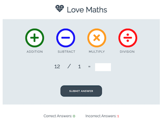

# Code Institute - Code a Math Game Challenge solution

This is a solution to the a challenge from the [Code Institute
](https://codeinstitute.net/) Javascript and Interactive Frontend Module to create a math game. 

## Overview

### The challenge

- Build an interactive math game that can increment scores and correct answers.

### Screenshots

- [Mobile](assets/wireframes/mobile-design.png)
- [Desktop](assets/wireframes/math-game-design.png)

### Links

- [Repo](https://github.com/Franciskadtt/love-maths-game)
- [Live site](https://franciskadtt.github.io/love-maths-game/)

## My process

### Built with

- HMTL
- CSS 
- Javascript

### What I learned
- understand how JavaScript interacts with the dom.
- learn how to use event listeners to wait for user interaction.
- learn how to avoid creating global variables.
- become comfortable with JavaScript functions.

### Steps
1. Functions
    1. runGame() = to run the game run game 
    2. checkAnswer() = to check the user's answer 
    3. calculateCorrectAnswer() = a helper function will perform the calculation and return the correct answer and the current game type to check answer.
    4. incrementScore() = to increment the score if the answer is correct
    5. incrementWrongAnswer() = to increment the incorrect answer count if the answer is wrong.
    6. displayAdditionQuestion() = to display the addition question 
    7. displaySubtractQuestion() = to display the subtract question 
    8. displayMultiplyQuestion() = to display the multiply question
    9. displayDivisionQuestion() = to display the division question

2. Event listeners
- Add two kinds of event listeners. 
    1. Code to be executed when the page has finished loading
    2. Code to be executed when the user clicks a button

3. There are three things to add every time a new question is created:
    1. run game function needs to have the new game type added
    2. create our display question function
    3. update our calculate correct answer function

## Coded By

- Website - [Franciska Du Toit](https://franciskadutoit.com/)
- Instagram - [@designed.byfranciska
](https://www.instagram.com/designed.byfranciska/)
- LinkedIn - [@franciskadutoit
](https://www.linkedin.com/in/franciskadutoit/)

## Acknowledgements

- All content and images were provided by [Code Institute
](https://codeinstitute.net/)

